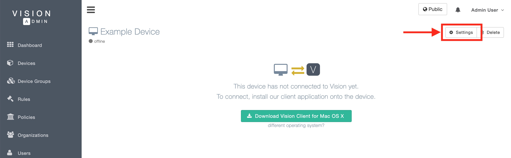
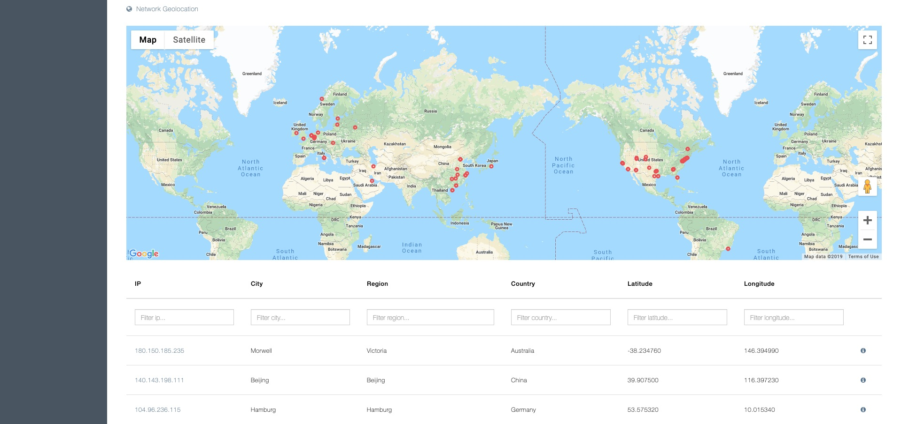
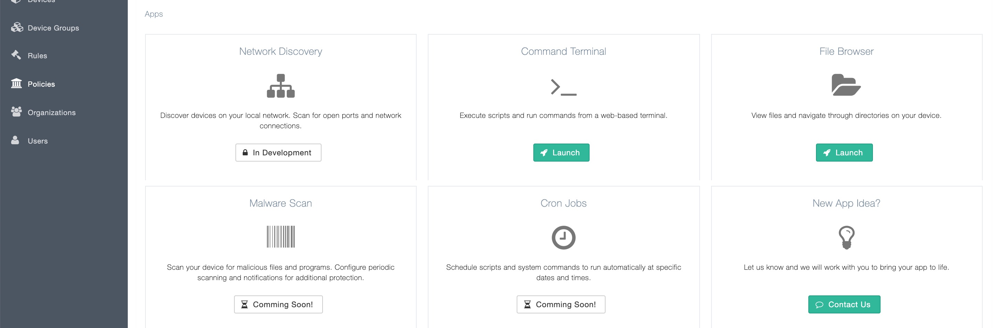

# vision-client

> Vision Client is the client companion to Vision Admin. Vision Admin is a platform for real-time monitoring of computer systems and a user-friendly web interface for remote access and performing technical computer tasks.

## Install Vision Client

```bash
npm i -g vision-client
```

## Setup

- After installing Vision Client, sign up for an account and login to Vision Admin https://visionadministrator.com
- Add your device https://visionadministrator.com/devices/create

## Get your device token
Navigate to your device settings page.


Copy you device's token.


## Usage

From the command-line, run the following command with the device token that you copied from the web application.
```
vision-client -t <device_token>
```

## Enjoy
Monitor your system's performance in real-time.


With Google Map's API and IP2Location's IP-Geolocation database integration, view a real-time map of your device's active network connections. This includes city, region, country, longitude, and longitude information.


View your device's network interface & connection data.


View process usage data and stop resource-heavy processes.


View in-depth system and hardware information.


Advanced web-based tools for remote access and performing technical computer tasks easily.


## License

[MIT](http://vjpr.mit-license.org)
